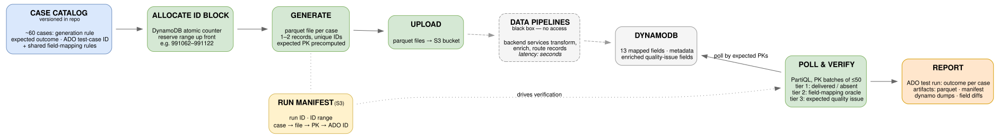

# Data Ingestion E2E Testing — Approach & Plan

> **Status:** Draft · **Date:** 2026-07-02
>
> **Scope:** test automation for the ingestion data-flow — asynchronous, black-box, end-to-end.

---

## 1. System under test

```
generate parquet files (rules) → upload ~60 files to S3 → data pipelines (black box,
backend services — no access) → transformed/enriched records land in DynamoDB
```

- Each parquet file contains **1–2 records**; each record carries **unique internal IDs**.
- Filenames encode a case and an ID, e.g. `991001-case3-violation-description.parquet`; IDs increment per file, and each new test run continues from the last used ID (**stateful generation** — IDs are never reused).
- Pipeline latency: **seconds** (to be confirmed; pipeline status tracking to be explored).
- DynamoDB PK is **derivable** from the generated data: `pk = field1|field2`.
- Records in DynamoDB have **no TTL** — generated data accumulates forever.
- Transformation: ~30 parquet fields → **13 mapped fields** (renames, merges, format changes) + **pipeline processing metadata** + **enriched fields** (incl. quality-issue fields).
- Stack: **Java**, run in **GitHub workflow**, state/artifacts in **S3**, results in **DynamoDB**, each case maps to an **ADO test case ID** (results published per run).

---

## 2. Core idea

Treat each parquet file as a **self-describing test case**, and each test run as a **manifest-driven batch**.

- A **case catalog** (versioned in the repo) defines the ~60 cases declaratively: generation rule, family (see §4), expected quality issue, ADO test-case ID. Generator, verifier, and reporter all read from it — single source of truth.
- At run start, the framework **atomically reserves an ID block** (e.g. 991062–991122), then writes a **run manifest** to S3: run ID, ID range, per-case mapping (case → filename → internal IDs → expected DynamoDB PK → ADO ID). Everything downstream keys off the manifest, so the run is reproducible and debuggable after the fact.



---

## 3. Key design decisions

### 3.1 Stateful ID allocation

- **DynamoDB atomic counter**: one item, `UpdateItem` with `ADD`, the whole block reserved in a single call. Race-free by construction — a local run and a CI run can overlap safely; their ID ranges (and thus filenames and PKs) cannot collide.
- Reserve the block **up front, before generating anything**; never reuse IDs even if the run fails mid-way. Gaps in the sequence are cheap; collisions in a system we can't clean up are not.
- Add a GitHub Actions **`concurrency` group** as belt-and-braces to keep CI runs sequential — but do not rely on it (local runs bypass it).

### 3.2 Polling (seconds-level latency → single-job design)

- One workflow job runs the whole cycle: allocate → generate → upload → poll → verify → report. No decoupled submit/verify split needed.
- The generator **precomputes every expected PK at generation time** and stores it in the manifest.
- The poller runs **PartiQL `IN` queries, ≤50 PKs per query** (2 queries per cycle for the full batch) — no scans, no other runs' data. **Delta-poll:** drop PKs from the query set as they are found.
- Keep the poll deadline generous (a few minutes) — seconds on a good day is longer under load.
- If pipeline status turns out to be trackable, plug it in later as an **extra signal, not a dependency**.
- **One poller per run, not per test:** generation/upload/polling happen once (batch fixture); the per-case tests classify from already-collected results.

### 3.3 No cleanup

No TTL, data accumulates — acceptable. Rule: never assert "table contains exactly N records"; always assert against **our own PK set** from the manifest.

---

## 4. Outcome model (all cases are negative-based)

### Family A — delivered with quality issue

The record must land in DynamoDB **and** the enriched field must show the specific error for that case's violation. Three assertion tiers per record:

| Tier | Checks | Scope |
|---|---|---|
| **1 — Delivery** | record present before deadline | per record |
| **2 — Mapping** | the 13 initial fields arrived correctly (renames, merges, format conversions); pipeline metadata gets shape checks only (present, plausible) | **shared** table-driven mapping model across all cases |
| **3 — Violation** | the expected quality issue for *this* case | declared per case in the catalog |

### Family B — must not be delivered

Absence assertion. Async-absence trick: assert only **after all Family A records have landed** (they are the progress signal that the pipeline processed the batch), plus a short grace period.

The external-log check for these records is **deferred**: report in ADO as passed-with-note (*"delivery-absence verified; log check deferred"*) so it is not mistaken for full verification.

### Classification per case

| Outcome | Meaning |
|---|---|
| `PASS` | expectations met |
| `WRONG_ISSUE` | delivered, but tier 2/3 mismatch — field-level diff attached |
| `MISSING` | Family A record never arrived before deadline |
| `LEAKED` | Family B record arrived when it should not have |

---

## 5. Structure (conceptual)

| Component | Responsibility |
|---|---|
| **`catalog/`** | case definitions as data files (YAML/JSON): rule parameters, family, expected quality issue, ADO ID — plus one shared **field-mapping spec** (parquet field → dynamo field, transform type) |
| **Generator** | builds parquet per case from catalog rule + allocated IDs; emits the run manifest |
| **State** | ID allocator (DynamoDB atomic counter) |
| **AWS layer** | S3 upload, PartiQL polling |
| **Verifier** | three-tier oracle + outcome classifier |
| **Reporter** | ADO Test Run API + artifact bundling (manifest, parquet, dynamo dumps, diffs) |
| **Runner** | JUnit, one **parameterized test per case** fed from the manifest → 60 individual results mapping 1:1 onto ADO test cases |

The **field-mapping spec is the most valuable test asset**: capture it from the pipeline team's docs and version it. When the pipeline changes, the diff is one file. Keep expectations declarative per case, not buried in test methods.

### Reporting to ADO

Map the run to an **ADO Test Run**: create at start, publish per-case outcomes (ADO IDs from the catalog) at the end, attach the manifest and diffs to failed results. JUnit is the local execution engine; ADO gets structured results via its REST API.

Persist the downloaded DynamoDB items next to the generated parquet files in the run's S3 folder / workflow artifacts, so a failed case is diffable without re-running.

---

## 6. Plan

| Phase | Content | Purpose |
|---|---|---|
| **1 — Foundation** | ID allocator + run manifest + catalog format | prove a reserved block survives concurrent local + CI allocation |
| **2 — Thin slice** | 2–3 cases end-to-end (one Family A, one Family B): generator, upload, poller, tier-1 delivery check only | flush out real pipeline latency and PK-derivation surprises early |
| **3 — Oracle** | field-mapping spec + tier 2/3 assertions, outcome classification, diffs in failure output | make failures diagnosable |
| **4 — Full catalog** | all ~60 cases as data | scale |
| **5 — CI + ADO** | workflow (concurrency group, artifacts), ADO test-run publishing | operationalize |

---

## 7. Open items

- **Confirm pipeline latency** and whether pipeline status is trackable from our side.
- **Authoritative field-mapping rules** from the pipeline team — otherwise expectations get reverse-engineered from observed output, which bakes pipeline bugs into the oracle.
- **Exact quality-issue codes/format** per violation type.
- **External-log verification** for Family B records — deferred; revisit once the log system access is clarified.
