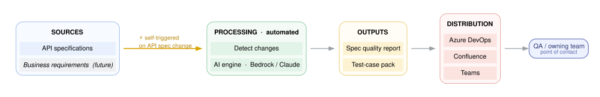
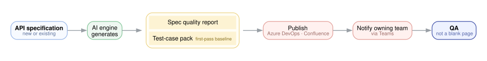
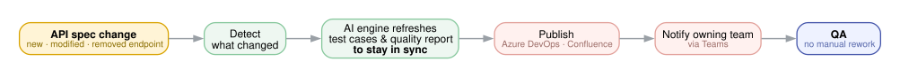
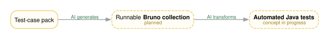

# API Quality Platform — Solution Overview

> **Status:** Draft for management review · **Audience:** Senior management · **Author:** [you] · **Date:** 2026-06-22
>
> **Purpose:** communicate what the platform delivers — the problems it solves, the benefits it brings, and where it's heading.
>
> *Technical detail sits in an expandable section so this reads as a business document, with depth available on demand.*

---

## 1. In short

We've built a system that automatically turns our **API specifications** into two artifacts per service, using AI (AWS Bedrock / Claude):

- an **API spec quality report**, and
- a **test-case pack**.

It **detects when an API changes** and keeps its outputs in sync. It's proven across small, medium, and large APIs, and it's **designed to feed** the testing tools we already use — **Azure DevOps**, Confluence, Teams — and our test-automation workflow.

---

## 2. The problem

- We maintain **hundreds of APIs**. Designing tests for them is **manual, slow, and expensive** — and QA capacity is limited.
- **Spec quality varies**, and contract issues tend to surface late — during integration testing — where they're expensive to fix.
- **Test design is inconsistent** — every engineer brings their own style, format, and depth, so coverage and quality vary from person to person, with no shared baseline.
- Every new or changed API multiplies this work, and **test coverage struggles to keep pace**.

---

## 3. What it does (working today)

| Capability | What it does |
|---|---|
| **Change detection** | Scans the API sources and identifies exactly what's new or changed, tracked in an enriched registry (commit / service / version) |
| **AI test-case generation** | Per API: produces a structured **test-case pack** |
| **AI spec quality report** | Per API: reviews the spec and produces a **quality report** alongside the test cases |

**Proof of scale:** it handles real-world API sizes — e.g. **95 test cases** generated for one large API in a single pass. *(This demonstrates scale; generation quality is being refined and validated — see Milestones.)*

---

## 4. How it works

The flow is **self-triggered on an API spec change** and runs end to end with **no human in the loop** until the results reach the QA / owning team.

> **Technical detail (render as a Confluence *expand* macro):**
> - The **registry** is enriched on every run and keyed by commit, service, and version — that's what makes change detection cheap: we only reprocess what actually changed.
> - The AI engine **prepares a compact representation** of each spec plus structured prompts before calling Bedrock, to keep cost and token usage controlled.

---

## 5. Use-cases

**UC-1 — Automated test-case baseline.** For any API — new or existing — the platform generates a first-pass **test-case pack** (plus a **spec quality report**) and publishes them. The QA starts from this baseline instead of a blank page, giving **consistent coverage across services and teams**.

**UC-2 — API change handling.** When an API spec changes — a new, modified, or removed endpoint — the system **detects what changed** and **refreshes both the test cases and the spec quality report to stay in sync** with the contract, then publishes the updates and (optionally) notifies the owning team. **No manual rework.**

**UC-3 — From test cases to automation.** Generated test cases can feed **runnable API collections (Bruno)** and, in turn, **automated Java tests** — extending into the workflow a QA already owns (test design, manual testing, automation). These steps are **planned**; a concept for the Bruno→Java transformation is already in progress.

---

## 6. Benefits

**For QA**
- A baseline test-case pack per API instead of starting from scratch.
- A spec quality report that flags contract issues before testing.
- Outputs that feed both manual testing and automation.
- Test cases that stay in sync as APIs change.

**For management / org**
- Coverage that scales across hundreds of APIs without scaling effort linearly.
- A shared quality baseline instead of per-engineer variation.
- A path to managing test cases in **Azure DevOps** — a dedicated test-management tool — and a mature test-management process.
- A foundation for quality metrics.

---

## 7. Milestones

| Milestone | Status |
|---|---|
| Change detection (registry-tracked) + AI generation of spec quality report & test-case pack | **Delivered** |
| Proven across small / medium / large APIs | **Delivered** |
| Outputs re-generated when an API changes | **Delivered** |
| Generation quality refined & validated (evaluate vs business logic, tune prompts) | **In progress** |
| Test cases published into **Azure DevOps** | Planned |
| **Teams notifications** (per team / channel, optional) | Planned |
| **Quality dashboard** (per-service quality score, coverage) | Planned |
| **Bruno → Java** test automation | Planned |
| Broader rollout across testing teams | Planned |
| Business-logic coverage via business requirements | Future |

---

## 8. Where it stands

The platform is **operational today** — it detects API changes and generates a spec quality report and a test-case pack per service, proven across API sizes. The **near-term focus** is validating and refining output quality, and publishing into the tools teams already use (Azure DevOps, Teams). Richer, business-logic-driven coverage is a deliberate **later** step.
